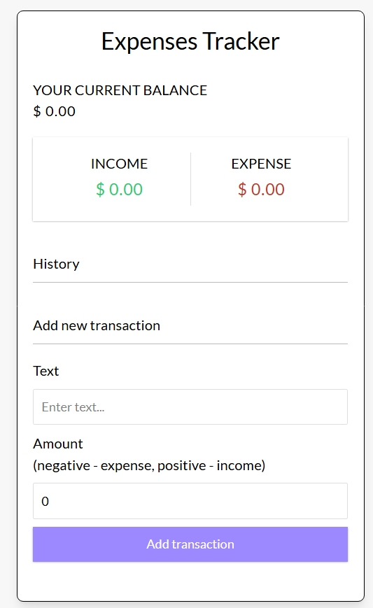

#  Expenses Tracker

A tracker app that tracks your expenses and incomes and give the current balance amount . The app is built with ReactJs.

  

##  Table of Contents

-  [Technologies-Used](#technologies-used)

-  [Installation](#installation)

-  [License](#license)

  

##  Technologies-Used

  

- ReactJs

- Tailwindcss

  

  

##  Installation

  

Step-by-step instructions to set up the project locally:
1. Clone the repository:

        git clone https://github.com/Roshan-Metrix/Expenses_Tracker.git

  
2. Navigate to the project directory:

       cd expenses_tracker

<i>Either install locally or run in a container</i>

   - **Locally**:
   
3. Install dependencies

       npm install  

4. Run App

       npm start dev

  - **Docker**:
   
3. Build and run the container

       docker-compose up --build

4. Access the app

       Open your browser and go to http://localhost:5173

## License

This project is licensed under the [MIT License](license.txt).

## Screenshot

  

